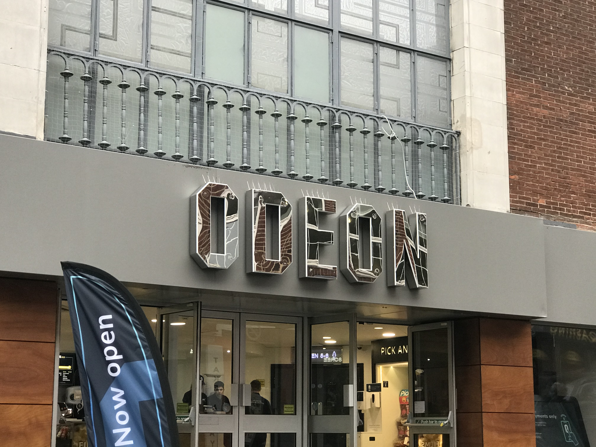
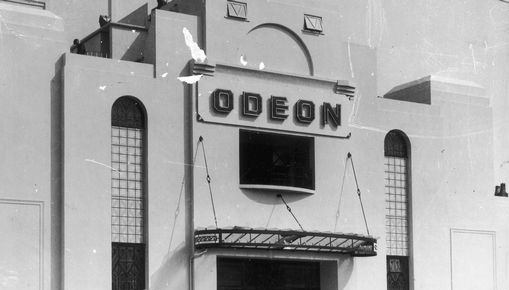
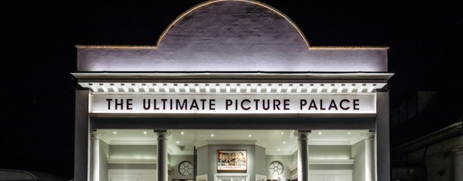
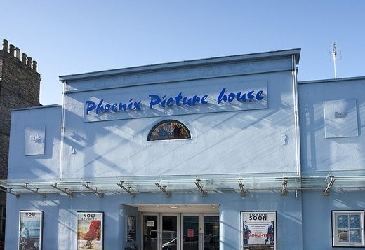

Despite all the new savvy ways to stream online, when we want to see the new bond or the latest instalment of the marvel cinematic universe we instinctively head to the cinema. You may not think you’ve ever paid much attention to the typography as you’ve entered the cinema, but you could probably accurately imagine what the logo of your local cinema looks like. What typefaces do the cinemas of Oxford use and how do they fit into their branding? Let's take a look.

The one we all know and love: the Odeon. Even if you’re not an avid cinema goer, you’ve probably happened to find yourself in an Odeon branch at some stage in your life. 

\
The typography the Odeon uses on their name hasn’t changed much since it was founded in 1928 (above), which is probably what makes it so distinctive to us. It feels so familiar as, looking at the old typography, you can see the block style lettering has stayed the same. Only the colour and height seem to have changed the most. The heavy weight, and low contrast capital letters make it bold and captivating, just as films should do. This typeface makes a statement; appropriate as they are one of the leading UK cinemas. Interestingly, there are no rounded edges on the typography. Could this be a nod to the rectangular shape of a cinema screen? The condensed width of the letters is somewhat reminiscent of the typography that can be seen on earlier theatres and cinemas such as on now showing signs, often seen on what is known as a ‘marquee’.

Curzon is a smaller chain of cinemas with most of them being located in London. However, this one can be found on the roof of Westgate shopping centre. 

We find ourselves with another sans serif typeface in all caps, except this time not shying away from those rounded edges on letters such as C and O. The typeface is of a regular weight and low contrast, maintaining legibility and simplicity. It is also monospaced which seems to be a design choice for this particular brand as it is not on their name when googling the brand or viewing the website. These features together create a slightly more luxurious tone as they allow for ease on the eyes when reading the name. As Westgate's website states 'Curzon offers the finest cinematic experience in Oxford' (<https://westgateoxford.co.uk/roof-terrace>), this seems to match up perfectly.

A hidden gem of Oxford entertainment, The Ultimate Picture Palace is tucked away down Cowley Road.

There seems to be a pattern emerging as the typography is once again sans serif, low contrast and in capital letters. The width is condensed on some of the letters such as U and T and some aspects aren’t quite the same height such as the rounded parts of letters R and P. This seems the most like typical cinema signs as ‘little time would have been given to typographic niceties’ (<https://readerboards.co.uk/american-cinema-style-signs/>) so the letters didn’t always look like they belonged to the same typeface. Perhaps this is an attempt to feel more authentic? It is an independent cinema after all, and it hasn’t tried to be too modern as it ‘still has the original box office window’ from 1911.

Throwing a curveball is the Phoenix Picturehouse. Once an independent cinema, it is now part of a larger chain of Picturehouse cinemas owned by Cineworld. 

The handwritten style of this typeface sets it apart from the others. Where we have seen all caps, only the two letter P's are capitalised here. Somehow handwritten styles come across as more friendly, being more approachable than a large heavy weight typeface. This fits in with the values the company strives for as they claim their cinemas are 'welcoming' and 'nestled in the heart of their neighbourhoods' (<https://www.picturehouses.com/about-us>). There is also a somewhat high contrast, making this typeface more visually interesting. Though it is part of a chain, there may be an attempt to give off the impression of an independent cinema as the lack of capitals and block style letters gives it a less commercial tone.

Header image by Myke Simon on Unsplash.