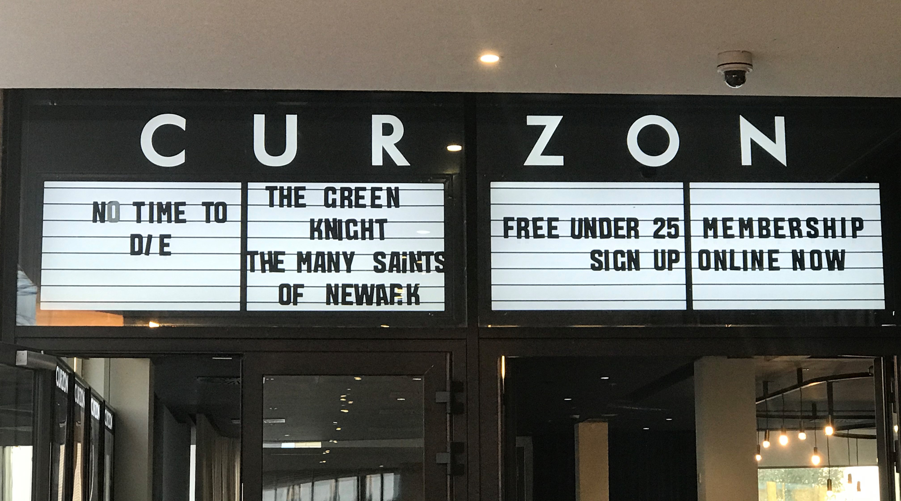

Despite all the new savvy ways to stream online, when we want to see the new bond or the latest instalment of the marvel cinematic universe we instinctively head to the cinema. You may not think you’ve ever paid much attention to the typography as you’ve entered the cinema, but you could probably accurately imagine what the logo of your local cinema looks like. Interested in the different typography used by different brands, I headed out to look at the cinemas around the city of Oxford.

PICTURE OF ODEON NOW AND ORIGINAL

The one we all know and love: the Odeon. Even if you’re not an avid cinema goer, you’ve probably happened to find yourself in an Odeon branch at some stage in your life. The typography the Odeon uses on their name hasn’t changed much since it was founded in 1928, which is probably what makes it so distinctive to us. It feels so familiar as even looking at the old typography you can see the block style lettering has stayed the same. Only the colour and height seem to have changed the most. The heavy weight, and low contrast capital letters make it bold and captivating, just as films should do. Interestingly, there are no rounded edges on the typography. Could this be a nod to the rectangular shape of a cinema screen? The condensed width of the letters is somewhat reminiscent of the typography that can be seen on earlier theatres and cinemas such as on now showing signs, often seen on what is known as a ‘marquee’ (see below).

PICTURE OF MARQUEE

PICTURE OF CURZON

Curzon is a smaller chain of cinemas with most of them being located in London. However, this one can be found on the roof of Westgate shopping centre. 

We find ourselves another sans serif typeface in all caps, except this time not shying away from rounded edges on letters such as C and O. This, alongside the almost monospaced lettering on the typography of this branch, gives off a more sophisticated atmosphere. Westgate’s website insists that ‘Curzon offers the finest cinematic experience in Oxford’ which seems reflected in this typography. NEED MORE.

PICTURE OF PALACE

 A hidden gem of Oxford entertainment, The Ultimate Picture Palace is tucked away down Cowley Road. There seems to be a pattern emerging as the typography is once again sans serif, low contrast and in capital letters. The width is condensed on some of the letters such as U and T and some aspects aren’t quite the same height such as the rounded parts of letters R and P. This seems the most like typical cinema signs as ‘little time would have been given to typographic niceties’ so sometimes the letters didn’t look like they were all part of the same typeface. Perhaps this is an attempt to feel more authentic? It is an independent cinema after all, and it hasn’t tried to be too modern as it ‘still has the original box office window’ from 1911.

PICTURE OF PHOENIX

Throwing a curveball is the Phoenix Picturehouse. Once an independent cinema, it is now part of a larger chain of Picturehouse cinemas owned by Cineworld. Only the two letter Ps are capitalised in this cinemas name with the typeface being a somewhat handwritten style. There is also more of a contrast in the lettering making this typeface more interesting to look at. Though it is part of a chain, there may be an attempt to give off the impression of an independent cinema as the lack of capitals and block style letters seems less commercial. The typeface feels friendly and seems to match their values as they claim that their ‘communities make us’.