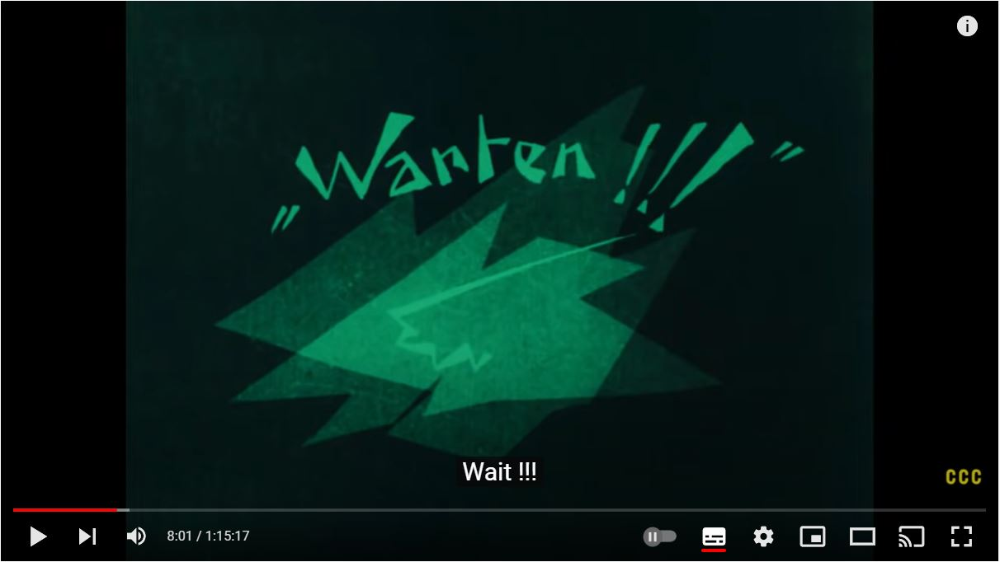
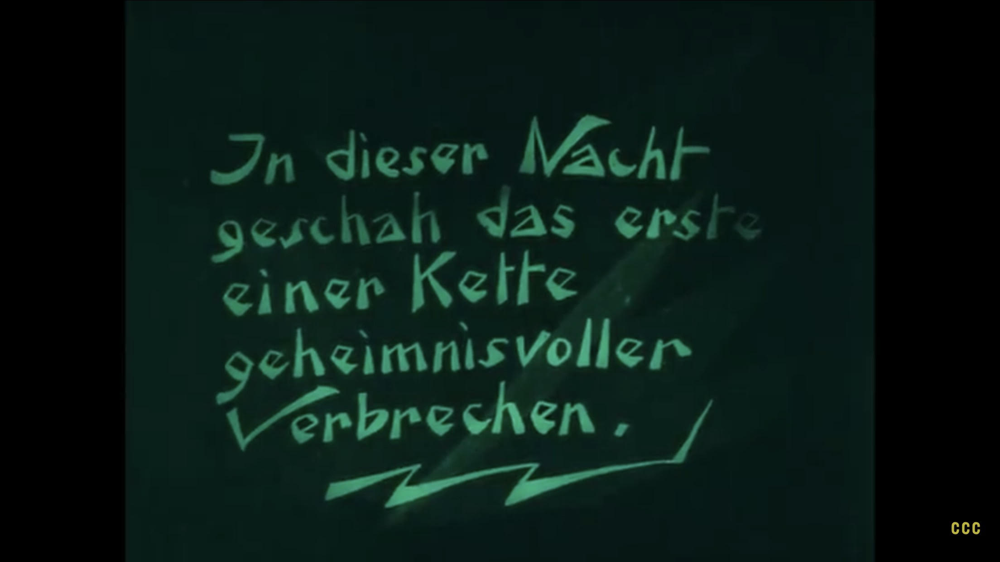

Once opon a time, typography played a much bigger role in cinema. Any text in films now is very limited. Subtitles are moslty available on tv and streaming services if you need them, or like me, have become so accustomed to having them on that the language genuinely makes no sense when you turn them off. However, back in early days of cinema, before the age of the 'talkies', audiences enjoyed silent movies. Whilst actors worked overtime trying to communicate story and emotion, text was essential to the film.

Silent movies would often feature title cards, or 'intertitles', that would feature speech, a date/time or other information to help drive the films story. Think of these as providing a voice for the actors and expressing what can't be expressed solely through acting. As these were so crucial to communicating details to the audience, the typography had to be legible. You wouldn't want your movie ruined because the text is too hard to read. The typefaces used would often be a heavy weight, large and centered on the screen.  

Whilst they had to remain legible, these interitles were a chance for a bit of fun. With the standard for silent films being black and white, design elements were limited but the text could easily be designed to create some excitement. 

Let's take a look at an example:

The Cabinet of Dr. Caligari. Apparently translates to 'Wait!'

There were two different types of intertitles. 'Dialogue intertitles' are what they sound like, speech on screen, like the one above. 'Expository intertitles' served as providing extra information to the audience, like the one below:

(Translation: that night the first in a series of mysterious crimes took place)

It was easy for silent films to be viewed in all languages as the text simply had to be changed/translated. This concept inspired the idea for the subtitles we see in film and TV today. However, it is now layered over the motion clip instead of a dedicated break in the film as this would ruin the flow of the film.

Text is not as much of a focus in films now. We may see subtitles, or some on screen text such as a time/date indicator but these may not be as interesting to look at as the intertitles in silent films as filmmakers do not want it to take the audience's focus away from more important aspects. 

Header image by Elijah Mears on Unsplash.