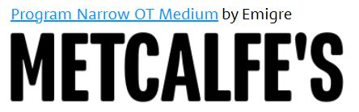

It just wouldn't be the cinema without some popcorn. Let's have a look at the typefaces that the big UK brands are using on their packaging. 

Butterkist\
They boast about being the 'Nation's favourite popcorn' and judging from their unique typeface, it is clear why.\
Being high contrast, varying weights and sizes, this fun and bold custom typeface perfectly reflects the fun nature of popcorn. The company themselves have stated that the typeface is intended to represent 'the moving of the popping corn' (<https://www.designweek.co.uk/issues/13-19-february-2017/butterkist/>). \
I don't know about anyone else but the typeface somehow manages to look smooth like butter with the curved edges and tails, flowing seamlessly into each other. The whole typeface manages to appeal to the taste buds, making this product look like something perfect for those with a sweet tooth. \
The brand has had a few design changes over the years since it was founded in 1914, but the typeface used has remained the same, being exciting, engaging and eccentric.

Proper Corn\
I've always assumed it was one word, but looking at the name it seems it is meant to be separate as the brand has chosen to use two different typefaces.\
The typeface used for 'proper' is heavy weight, low contrast, a somewhat condensed width and in all caps. It feels not so dissimilar to typefaces seen on cinema branding. On the opposite end, the typeface for 'corn' is handwritten, light weight, high contrast and only the initial letter 'C' is capitalised. It feels fun and creative with the letter 'C' even hooking onto the letter 'O' in 'proper'. This contrast is unexpected, just like the unexpected nature of popping kernels. \
The exact typeface couldn't be found so this may be a custom design. Getting the image up on google it appears as though the white lines inside the letters aren't perfectly straight and almost look slightly shaky as if they are hand drawn. This distinction may not be intentional as it can't be seen that easily on packaging, but it does add to this creative tone of the packaging in general with the illustrations and bright colours. 

Metcalfe's\
Simplicity is key here. The low contrast and heavy weight of this typeface is easy to read and gets the job done. It almost feels though it could be marketing as popcorn for adults as the calories are also so boldly presented on the packaging, being the same size as the brand name itself. The typeface has rounded corners however, taking down this tone just a notch. 

I seem to have identified the typeface as 'program narrow OT medium' by Emigre (above). The only aspect that strays from this is the apostrophe used, perhaps a design choice from the brand to look slightly more sophisticated. This brand doesn't necessarily feel as exciting as some of the others but does clearly communicate it's product.

Joe and Seph's\
Another brand that has used two different typefaces, but possibly for very different reasons. The two typefaces almost suggest two different personalities as they are quite contrasting. Despite this, and quite deceivingly, Joe and Seph are not two different people. It makes so much sense when finding out the creators name is... wait for it... Joseph. This is a family business and this seems perfectly reflected in these typefaces and added graphics which suggest it is hand crafted.\
The typeface used for 'Joe' is heavy weight, low contrast and in all caps. It doesn't give away too much but possibly represents the creator himself. The typeface used for 'Seph's' is a script font and has quite a high contrast in the lettering. It feels more sophisticated and suggests luxury, representing Joseph's talent at creating high quality food.\
Looking at the typefaces, you may not necessarily assume they are a popcorn brand but can certainly see it is a high quality food product and is a family business.

Header image by Lynda Sanchez on Unsplash