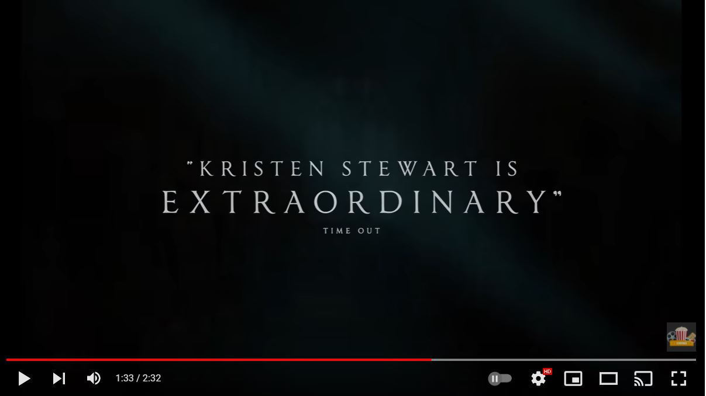
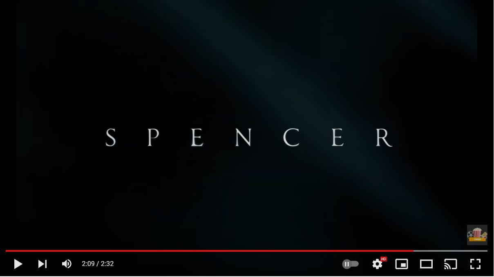
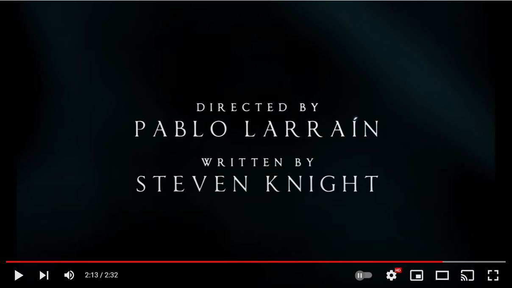
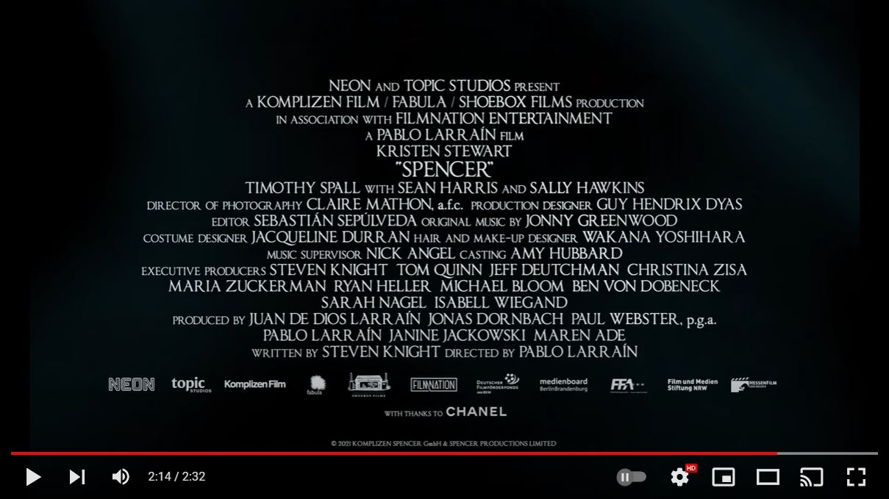
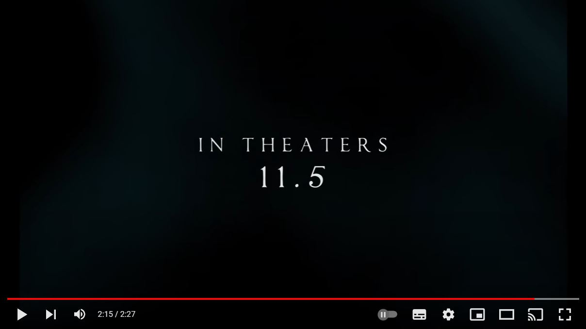
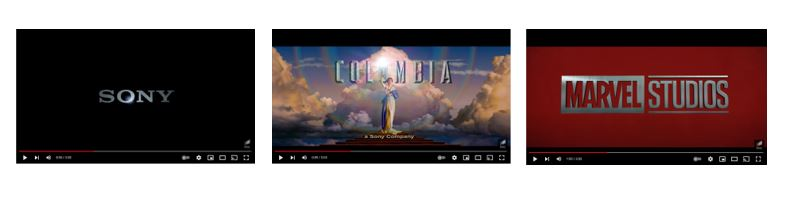
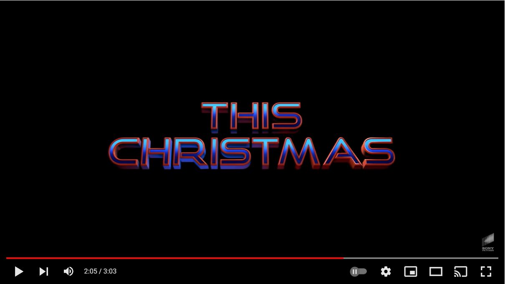
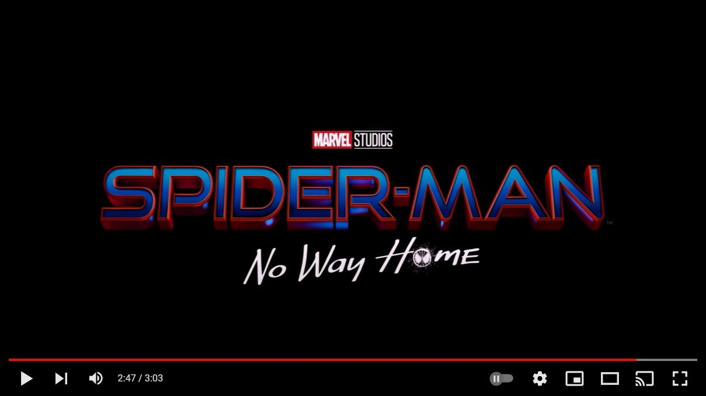
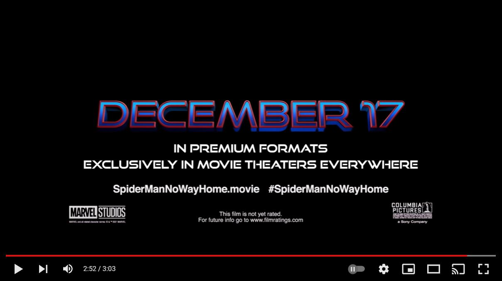

While some may resent the trailers that play before a film, in all the times I've been to the cinema I have never missed them. However, I'm certain there are far more adverts than trailers than there ever used to be, or is that just me? On my recent cinema trips, I made sure to pay special attention to the typography used in the trailers.

**Spencer- watch the trailer here:** <https://www.youtube.com/watch?v=20BIS4YxP5Q>

The trailer mostly sticks to one typeface throughout. creating a definitive feel for this film. What is that feeling you may ask? Elegance, class and quintessentially British.

The typeface is a serif font which somehow gives off an appearance of higher class. This could be because serif fonts have been around for much longer whereas sans serif fonts are, perhaps, more modern, dating back to 1805 (okay, maybe not modern like your iPhone but more modern than 3200 BC when it is believed us humans started writing). Being a light/regular weight, the typeface feels very fragile suggesting wealth and luxury. It is somewhat monospaced and high contrast, creating a lot of space and creating an air of elegance.

What do all these different impressions have in common? One might, on occassion, use such descriptions when discussing those of royal blood. In other words, the font is fancy like the Queen.

The quotes from reviews that are shown are much larger than the publications that they are from. Whilst it is important for the publisher/author of quote to be on the screen in order to give credibility for the audience, the actual quote is more significant as this is what should draw people to the film.

The title of the film is the same as other text was throughout the trailer but it stands alone when it appears, making it clear that this is the title. It draws a lot of attention as it is centered in the middle and, again, monospaced. 

'Directed by' and 'written by' is a smaller size than the names of these people, highlighting their significant roles in creating the film.

A screen of close together text is shown that is purely there to give credit to other companies and people who also had significant involvement in the film. Film buffs or anyone interested would not be able to necessarily read this whilst sat in a cinema but could certainly go away and pause this on their own devices were they to watch it on youtube or elsewhere.

Finally it shows the release date the text 'in theatres 11.5'. Again, it is centered, large and in the same typeface as throughout the film. It is the last part of the trailer and the text shown so if the audience go away remembering anything about 'the film about Diana' it would hopefully be 'I think it's out in November'.

**Spiderman- No Way Home teaser trailer:** <https://www.youtube.com/watch?v=rt-2cxAiPJk>

Some of the first text we see in this trailer are the film company logos (Sony, Columbia and Marvel Studios). In all of these the typefaces are in capital letters, a heavy weight and low contrast with block-style letters. These elements combined help the logos appear striking, bold and eye-catching. Does this remind us of anything? Superheroes, perhaps? The logos are all silver in colour/look metallic. This is normal for marvel and columbia but sony doesn't always look this way. This could possibly be a stylistic choice by the company to fit in with the trailer.

The text that reads 'this christmas' is in a custom typeface for Spiderman (a special typeface you won't see elsewhere that is created just for these films). This typeface is very bold, being in capital letters, a low contrast and heavy weight. Our 'friendly neighbourhood Spiderman' is perfectly captured through this typeface with rounded edges as opposed to sharp corners which we would typically associate with danger. The sans-serif and range of colours also add to this and create a feeling of youthfulness and fun. Similar to fonts and typefaces used on futuristic/sci-fi films, the width of this typeface is somewhat extended.  

Each film in the three Tom Holland Spiderman trilogy uses this typeface but in slightly diffent colours. In this film, the colours used are quite different and significantly darker. This could be an attempt to signal change to the audience. Is this a new era or end of an era? Maybe this film will have a much darker tone. The use of two different colours (blue with a red border) create a contrast- much like the contrast between Spiderman and Peter Parker.

On the title screen 'Spiderman' is in same typeface as earlier and is centered and large, drawing the most attention- it is important that people know the film advertised is Spiderman as his character is the what attracts large audiences. \
The text 'No Way Home' is in a different typeface, seperating it from the other part of the title. There are elements of it that make it appear less perfect and therefore handwritten, as if Spiderman himself scrawled it on. The 'O' is replaced with a symbol representing his face. The text itself is slanted and the 'E' on home is capitalised even though in the rest of the text it is just the start of each word that is capitalised. This all comes together contrasting the big, bold 'Spiderman' text and instead represents his youth and the fact the trilogy is fun and lighthearted.

The last part of the trailer shows the official release date and some other text about the film. Again, we have our trusty Spiderman typeface, although, the date is the only text that uses the same colours as elsewhere, whilst the other text is in a plain white. This clearly brings our attention directly to the release date as our eyes notice the bold colours first and the text is in a significantly larger size, standing out amongst the rest.

Header image by Denise Jans on Unsplash