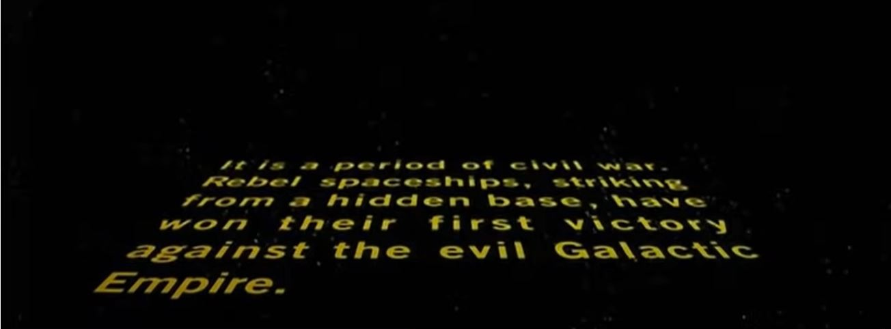
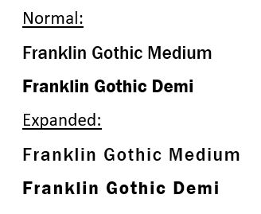
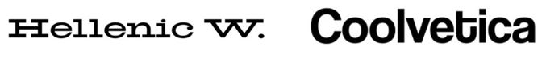

Kinetic typography- moving text. animation. 

**Star Wars**\
Are images even necessary here? Even someone who has never seen Star Wars could probably tell you what the opening is. The iconic yellow text crawls across the screen at an angle, disappearing into the universe behind it.

 

The font used is Franklin Gothic and it seems they have chosen for the width to be extended. This suits the film well as it creates a lot of space which is ideal since it is set in space itself.

The yellow colour stands out against the dark background whilst also matching perfectly as it resembles the colour of stars. 

The text is justified in the centre, helping it look visually appealing and easy for the audience to follow along. 

(Watch the opening from the first film here: <https://www.youtube.com/watch?v=iXDnFYu91vY>)

**Catch Me If You Can**\
Before we get into it, if you haven't seen this film...what are you doing? It's a MUST. 

This has to be one of the best title sequences ever, it is perfect at keeping you engaged right from the very start. 

It uses two different typefaces: Coolvetica and Hellenic Wide. 

The Coolvetica is the star of the show here, with the 

(Watch the opening here: <https://www.youtube.com/watch?v=aN715Rp4L74>)

**Grease**\
The opening to this film should never be skipped. 

(Watch the opening here: <https://www.youtube.com/watch?v=XA-xjRsY71w>)

**Sherlock**\
Okay, okay we know this is a TV show but it simply cannot be ignored.

(W