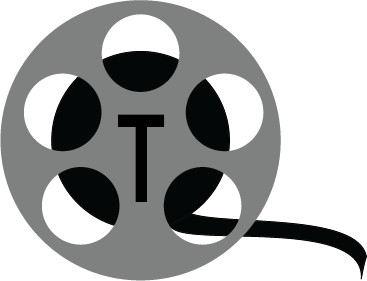
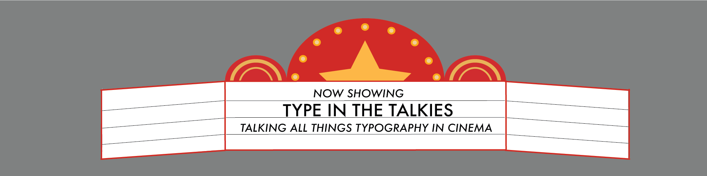

This blog will cover all things typography in cinema. Typefaces may be the last thing we think we pay any attention to when watching our favourite films, but this site aims to explore them. From the cinemas themselves to popcorn brands, it will look at different typefaces used and the meanings they allude. 

Designed in Adobe Illustrator, the logo for this site is a simple film reel with the letter 't' encorporated into the logo representing the title of the site 'type in the talkies'. The colours are simple but the overall design clearly links to film and cinema so works perfectly. 

This site name was chosen as it is not too long but is fun with the word 'talkies' referring to the name for films with sound. Although it is about more than just films, it is about the whole viewing experience, this still seems to communicate the general purpose of this site. 

Another Illustrator creation, the banner chosen is a design of the typical marquee signs that can be found on most theatres today but were more common on older cinemas and venues. It is engaging and the largest text is the title of the site, using the same typeface as the letter in the logo. This typeface is similar to those that would be found on marquee signs being sans serif, condensed and heavy weight.